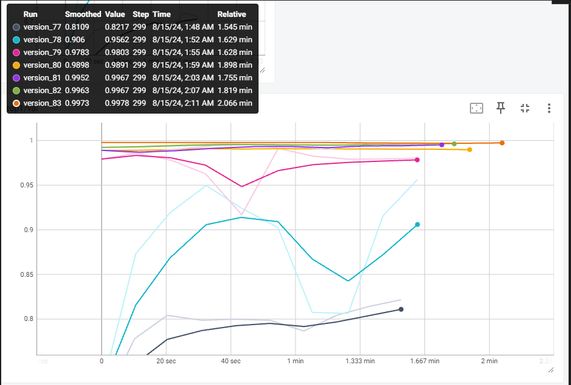

# PROJECT-1. Угадай знаменитость
Проект реализует задачу классификации знаменитостей:
* Билл Гейтц;
* Илон Маск;
* Джефф Безос;
* Марк Цукерберг;
* Стив Джопс.

Модель построена на основе сверточной нейронной сети **resnet34**, с использованием переноса обучения.

В хоже тестирвования удавалось достич accuracy 0.9978 на валидации.

## Задание
### В ходе решения этой задачи вы закрепите следующие навыки:

- решение задачи многоклассовой классификации;
- использование принципа переноса обучения;
- визуализация данных и полученных предсказаний модели.
### Что нужно будет сделать:

- Скачать и загрузить датасет (вы найдёте его в юните «Ваше решение»).
- Отрисовать один батч загруженных данных.
- Выбрать предобученную модель.
- Обучить многоклассовый классификатор, используя выбранную модель.
- Визуализировать предсказания модели.
- Описать полученные результаты в текстовой ячейке ноутбука.